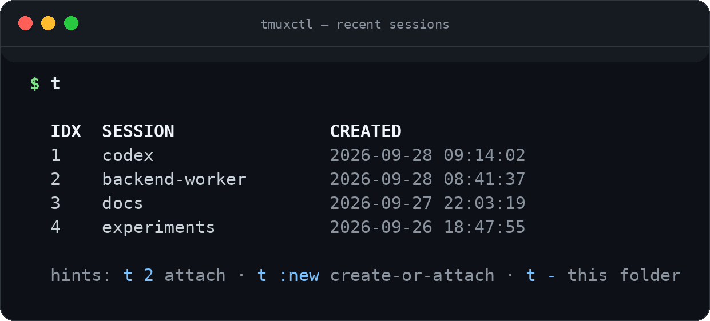
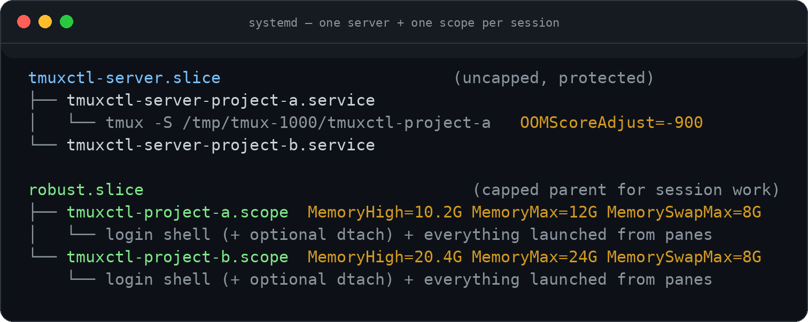
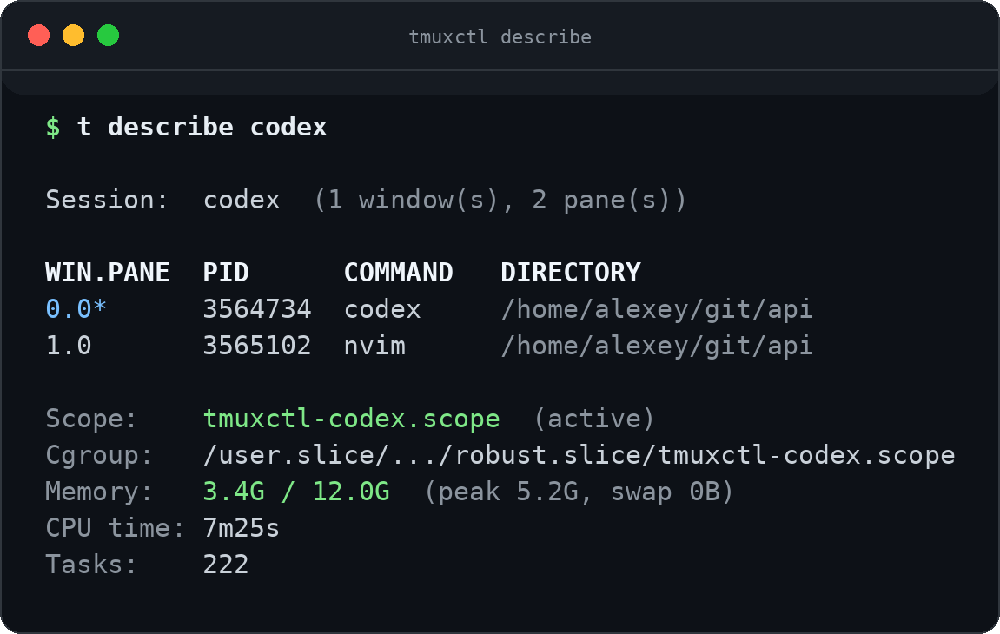
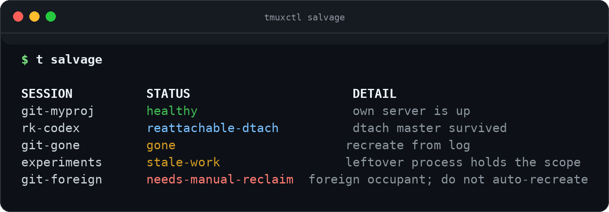

<div align="center">


# tmuxctl

**One session, one server, one memory cap.**

Jump between tmux sessions in one keystroke, keep every project in its own
blast-radius-isolated server, and keep long-running agent sessions fed with
scheduled messages — so a runaway build or a crashed agent never takes your
other work down with it.

[](https://pypi.org/project/tmuxctl/)
[](https://pypi.org/project/tmuxctl/)
[](https://github.com/alexeygrigorev/tmuxctl/actions/workflows/test.yml)
[](#isolation--memory-limits)

```bash
uv tool install tmuxctl
```

</div>

---

<div align="center">



</div>

## Why

If you live in tmux, three things eventually bite you:

1. **You lose sessions.** A dozen open projects, names you half-remember,
   `tmux ls` and `attach -t` every time. tmuxctl sorts by recency, gives each
   session a number, and `t 2` gets you there.
2. **One server, one blast radius.** Classic tmux runs a single server that
   owns every session. One runaway build or agent hits the machine's memory
   ceiling, the kernel kills the server, and *all* your sessions — including
   the innocent ones — disappear at once. tmuxctl gives every session its own
   tmux server, its own socket, its own systemd unit, and its own memory cap.
3. **Agents need babysitting.** An unattended coding session stalls and waits.
   tmuxctl sends it a message every 15 minutes until it isn't.

---

## Features

| | |
|---|---|
| ⚡ **Instant jumping** | Recency-sorted list, numeric shortcuts, attach by name, index, or `:current` |
| 🧱 **Per-session isolation** | Each session gets its own tmux server, socket, and systemd unit — one crash can't reach the rest |
| 🛡️ **Memory caps** | Per-session cgroup limits: throttle at `MemoryHigh`, contain the kill at `MemoryMax`, tune live with `t limit` |
| 🔁 **Recurring sends** | Scheduled messages to any session — perfect for keeping coding agents moving |
| 🩺 **Health checks** | `t doctor` for OOM risk, `t describe` for live RAM/CPU per session |
| 🚑 **Crash recovery** | `t salvage` rebuilds dead sessions from a durable event log — no guessing |
| 🧹 **Stray cleanup** | Find orphan servers, dead sockets, stranded `-CC` clients; reap them guarded |
| ⌨️ **Built for speed** | `t` alias, `tl` shorthand, `t -` from the current directory, bash completion |

## Quick start

```bash
uv tool install tmuxctl     # installs both `tmuxctl` and the short alias `t`
t                           # show your 10 most recent sessions
t :myproject                # create-or-attach — the session always exists after this
```

That's the whole loop: `t`, a number, and you're in.

> [!TIP]
> Inside tmux, `:current` means *the session you're in right now* — no typing
> names: `t limit :current --mem 24G`.

---

## Daily driving

### Cheat sheet

| I want to… | Type |
|---|---|
| See recent sessions | `t` |
| Jump to a session | `t codex` · by index: `t 2` · newest: `t attach-last` |
| Create it if it doesn't exist | `t :codex` |
| Session for the current folder | `t -` (uses the directory name) |
| Another session, same folder | `t -asd` → `git-workshops-asd` |
| Resize the window on attach | `t codex --resize-window` (short: `-r`) |
| Send a one-off message | `t send codex --message "check status"` |
| Schedule a recurring nudge | `t jobs add codex --every 15m --message "continue"` |
| See what's running inside | `t describe codex` |
| Change its memory cap live | `t limit codex --mem 30G` |
| Rename (retargets its jobs) | `t rename codex codex-main` |
| Kill it | `t kill codex` (or `t k 2 --yes` by index) |

**Two prefixes, two meanings:**

- `t codex` — attach only (fails if it doesn't exist)
- `t :codex` — create-or-attach

`t -` derives the name from the current directory, so `cd ~/git/workshops && t -`
is `t create-or-attach git-workshops`. Everything after the dash becomes a
suffix: `t - cy` → `git-workshops-cy`, and any command after it runs only on
first creation (`t - cy` launches `cy` inside the new session).

**Rename shorthand:** a leading dash is a suffix rule — `t rename 2 -cli` turns
`git-dataops-sop` into `git-dataops-cli`, deriving the prefix from the
session's own working directory, not its current name.

**Headless creation:** `t create-detached myproj -c ~/git/myproj` brings a
memory-capped session into existence and returns immediately — for tools that
attach over their own transport (tmux `-CC` control mode) and would otherwise
build raw, uncapped `new-session` commands. No-op if it already exists.

### Bash completion

```bash
t --install-completion      # commands, session names, and :session shortcuts
```

Working from this repo? `./install.sh` puts the checkout's `.venv/bin` on your
`PATH` and adds the `tl` (= `t l`) alias to `~/.bashrc`.

---

## Feed your agents

Send text straight into a pane — inline or from a shared prompt file:

```bash
t send codex --message "check status and continue"
t send rk-codex --message-file prompts/rk-codex-progress.txt
t send codex --message "status?" --enter-delay-ms 500   # default 200ms
t send codex --message "status?" --no-enter             # don't press Enter
```

Then put it on a schedule:

```bash
t jobs add codex --every 15m --message "check status and continue"
t jobs add rk-codex --every 30m --message-file prompts/rk-codex-progress.txt
```

With `--message-file`, the path is stored and the file is read at send time —
edit the file, future runs pick it up. Jobs live in a small SQLite database
(`~/.config/tmuxctl/tmuxctl.db`) along with the session event log.

Run the scheduler:

```bash
t jobs daemon
```

The daemon polls for due jobs and, every 60 seconds (`--health-interval`),
checks session health — logging only when the unhealthy set *changes*, not on
every tick. If a job fails 3 runs in a row it removes itself.

Manage jobs:

```bash
t jobs                      # list
t jobs show 2               # inspect
t jobs edit 2 --every 45m   # reschedule
t jobs pause 3 / resume 3 / remove 3
t jobs pause-current / resume-current    # target the session you're in
```

> [!NOTE]
> Jobs only fire while the daemon runs. To survive logout or reboot, keep it
> under `systemd --user`, `launchd`, or `cron @reboot` — see
> [Run the daemon as a service](#run-the-daemon-as-a-service).

---

## Isolation & memory limits

Classic tmux: one server process owns every session, so one kernel OOM kill
takes them all down. tmuxctl splits that apart — two units per session, on
purpose:



- The **server unit** holds only the multiplexer: no memory cap, shielded from
  the OOM killer.
- The **scope** holds your shell and everything you launch from panes —
  commands inherit its cgroup, so memory accounting covers the whole tree.
  Crossing the soft `MemoryHigh` throttles and reclaims; only a hard climb to
  `MemoryMax` kills processes, and only inside that one scope.

New sessions default to `MemoryMax=12G`, `MemorySwapMax=8G`, and `MemoryHigh`
at 85% of max. Override at creation (`t :my-session --mem 30G`) or change a
live session:

```bash
t limit my-session --mem 30G --swap 8G --high 24G
t limit :current --swap 12G
```

This updates the systemd scope directly:

```bash
systemctl --user set-property tmuxctl-my-session.scope MemoryHigh=24G MemoryMax=30G MemorySwapMax=8G
```

Live changes aren't written back to config — use the config files below when
you want future sessions to start with those limits. tmuxctl also warns when a
new cap would push the sum of all live caps past 120% (`oversubscription_max_pct`)
of RAM+swap; `t doctor` shows the same total.

<details>
<summary>What the create command actually looks like</summary>

```bash
systemd-run --user --unit=tmuxctl-server-my-session \
  -p Type=forking \
  -p Slice=tmuxctl-server.slice \
  -p OOMScoreAdjust=-900 \
  --quiet -- \
  tmux -S /tmp/tmux-<uid>/tmuxctl-my-session \
    new-session -d -s my-session -c /repo \
      systemd-run --user --scope \
        --unit=tmuxctl-my-session \
        -p MemoryHigh=25.5G \
        -p MemoryMax=30G \
        -p MemorySwapMax=8G \
        -p Slice=robust.slice \
        --quiet -- \
        /bin/bash -l
```

Full details on slices, scopes, and how the limits apply:
[docs/cgroups.md](docs/cgroups.md).

</details>

### Survive the session's own server dying

Per-session servers stop one session from killing *another* — they don't stop
a session's own server from dying if its workload blows the cap. tmux owns the
pty, so whatever runs in the pane dies with it.

Opt in to wrapping the first pane behind `dtach`, so the shell keeps running
even if the tmux server exits:

```toml
# ~/.config/tmuxctl/cgroups.toml
dtach_wrap = true
```

Requires `dtach` on `PATH` (`apt install dtach`). If the flag is on but `dtach`
is missing, the session starts as a normal shell and `t doctor` warns. Only
the session's first pane is wrapped; panes you create later inside tmux aren't.

<details>
<summary>Troubleshooting: an occupied scope blocks a recreate of the same name</summary>

`t kill` stops the session's scope with `systemctl --user stop`, freeing the
unit name. Two things have to go wrong together to leave it occupied:

1. the tmux server died uncleanly (crash or machine-wide OOM), so the normal
   kill path and its scope teardown never ran, **and**
2. a disowned background process (`Xvfb`, a dev server, anything
   `nohup`/`&`-launched) is still running inside that scope — the shell is
   gone, but the stray keeps the cgroup alive.

tmuxctl handles this instead of failing silently:

- a dead or failed leftover unit is reset automatically and the name is reused
- a surviving dtach master is treated as the session; recreate reattaches into it
- any other live process holding the scope: create succeeds, but the new
  session starts **uncapped**, and tmuxctl prints how to reclaim the name

```bash
t salvage
t doctor
systemctl --user status tmuxctl-<name>.scope

systemctl --user stop tmuxctl-<name>.scope   # kills the stray inside it
t :my-session
```

</details>

<details>
<summary>Sessions created before per-session servers</summary>

Older sessions still live on the shared default socket and keep working — but
they share one server, so if it dies they all die. `t doctor` marks them
`LEGACY`. Kill and recreate each one (`t kill <name>` then `t :<name>`, or
`t salvage --recreate`) to move it onto its own server.

</details>

---

## Health, recovery & hygiene

### `t doctor`

One command for OOM risk: RAM, cgroup OOM kills, live memory limits,
oversubscription, `dtach` wrapping, and whether each session is on its own
server or still `LEGACY`.

```bash
t doctor
```

### `t describe`

What's actually running inside a session — per pane: process, working
directory, cgroup; plus live RAM and CPU read from the session's cgroup, so
the numbers cover the whole process tree, not just the shell:

```bash
t describe codex        # by name
t describe 2            # by the index from `t list`
t describe :current     # the session you're in
```



A session you didn't start through `t` is uncapped — `describe` says so and
tells you which sessions are protected and which can still take the machine
down under memory pressure.

### `t salvage` — after a crash

For every tmuxctl session: is there something live to reattach to, or
something that needs recreating? It reads the durable event log instead of
guessing from session names.

```bash
t salvage
```



```bash
t salvage --recreate            # recreate every gone / stale-work session
t salvage --kill-dead-cwd       # kill strays whose cwd no longer exists (dry-run)
t salvage --kill-dead-cwd --yes
```

`needs-manual-reclaim` is never recreated automatically.

### The durable event log

Create, kill, rename, limit, health-check, and capacity-warning events go into
a log that survives the process and the cgroup dying — after a crash you can
still see which sessions existed and how they were created.

```bash
t sessions-log
t sessions-log --session git-myproj
t sessions-log --since 7 --limit 50
```

### `t strays` & `t reap` — hygiene

Scan every tmux socket for leftover sessions, dead socket files, orphan
servers, and stranded `tmux -CC` control-mode clients:

```bash
t strays                          # report
t strays --stale 14

t reap                            # kill detached idle servers, remove dead sockets
t reap --stale 14 --yes           # dry-run unless --yes; never touches attached servers

t reap-clients                    # detach duplicate orphan -CC clients only
t reap-clients --yes              # never kills a session, server, or interactive client
```

The daemon's health check can also salvage for you: `t jobs daemon
--auto-salvage` (or `auto_salvage = true` in config) recreates `gone` /
`stale-work` sessions automatically — `needs-manual-reclaim` stays manual.

---

## Configuration

Per-user defaults in `~/.config/tmuxctl/cgroups.toml`:

```toml
default_mem = "24G"
default_swap = "8G"
default_high = "20G"   # optional; omit to use 85% of mem
slice_max = "56G"
slice_swap_max = "16G"
oversubscription_max_pct = 120
dtach_wrap = false
auto_salvage = false
```

Per-project defaults in a project-local `cgroups.toml`:

```toml
mem = "24G"
swap = "8G"
high = "20G"
```

…or in the project's `pyproject.toml` (a project `cgroups.toml` wins when both
exist):

```toml
[tool.tmuxctl]
mem = "24G"
swap = "8G"
high = "20G"
```

`swap = "0"` gives hard no-swap behavior. `high` omitted tracks 85% of `mem`.
`--mem` and config apply at creation time.

---

## Installation

```bash
uv tool install tmuxctl            # primary
```

Alternatives:

```bash
pip install tmuxctl
uv tool install git+https://github.com/alexeygrigorev/tmuxctl.git

# from a local checkout
git clone https://github.com/alexeygrigorev/tmuxctl.git
cd tmuxctl && uv tool install -e . && ./install.sh
uv tool install -e . --force       # reinstall after updates
```

<details>
<summary>Run the daemon as a service</summary>

Create `~/.config/systemd/user/tmuxctl.service`:

```ini
[Unit]
Description=tmuxctl scheduler daemon
After=default.target

[Service]
Type=simple
ExecStart=%h/.local/bin/tmuxctl jobs daemon
Restart=on-failure
RestartSec=5

[Install]
WantedBy=default.target
```

Adjust `ExecStart` to wherever `tmuxctl` is installed — for an editable
checkout, point it at `.venv/bin/tmuxctl`. Then:

```bash
systemctl --user daemon-reload
systemctl --user enable --now tmuxctl.service
journalctl --user -u tmuxctl -f        # logs

# keep it running after logout (one-time, needs sudo):
sudo loginctl enable-linger "$USER"
```

</details>

## Development

```bash
uv sync --dev
uv run pytest
uv build
```

---

<div align="center">

**tmuxctl** — stop herding tmux sessions by hand.

[Issues](https://github.com/alexeygrigorev/tmuxctl/issues) · [PyPI](https://pypi.org/project/tmuxctl/) · [cgroups deep-dive](docs/cgroups.md)

</div>
